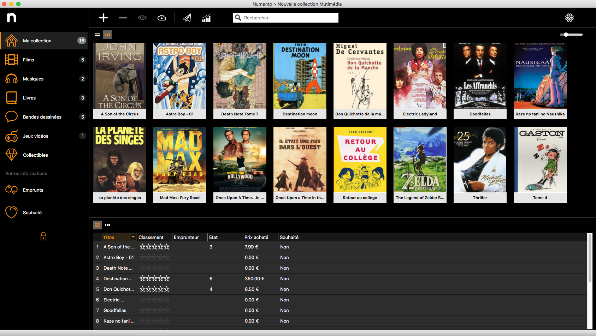
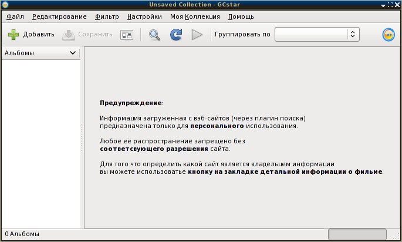
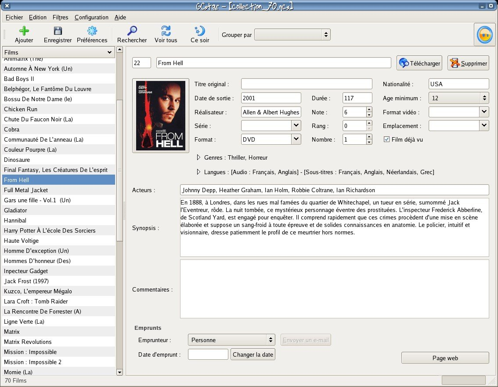

# Обзор аналогов
---

# Содержание 
1 [Обзор приложений](#application_overview)  
1.1 [Менеджер коллекций #1](#cm1)  
1.2 [Менеджер коллекций #2](#cm2)  
1.3 [Менеджер коллекций #3](#cm3)    
2 [Сравнение приложений](#comparison_of_applications)

<a name="application_overview"/>

# 1 Обзор приложений

<a name="cm1"/>

## 1.1 Менеджер коллекций #1
**Имя программы:** Numento2 
**Автор программы:** Intuisphere 
**Сайт:** www.numento.com  
**Последняя версия:** 2.3.5 
**Последнее обновление:** от 28 марта 2023 г. 
**Совместимость:** Windows 10, Mac OSX 
**Русский интерфейс:** нет 
**Цена:** free/24,99€/34,99€ 
**Размер программы:** 168.1 МБ 

Окно Менеджер коллекций #1  
  

Numento2 – это простое программное обеспечение для сбора данных, которое полностью настраивается и позволяет выбрать метод управления. 
Используя этот инструмент, вы сможете управлять своей библиотекой и каталогизировать книги,фильмы,иигры и др медиаресурсы, а также создовать собственные коллекции. 
Numento2 – это ваш личный помощник в хранении и эффективном использовании ваших личных библиотек и других медиаколлекций. 
Numento2 предназначен для хранения следующей информации: 
* Имя и вид коллекции;
* Имя автора, режиссера, исполнителя;
* Вид медиаресурса ;
* Имя медиаресурса; 
* Рейтинг медиаресурса; 
* Цена медиаресурса
* Дата релиза; 
* Статистика коллекции(кол-во объектов коллекции, размер данных, размер иллюстраций коллекции, размер файлов, общий размер коллекции в байтах; 
* А так же прочей информации.

Особенности телефонного справочника: 
- Простота и удобство использования; 
- Приятный внешний вид; 
- Высокая надёжность; 
- Защита ваших данных паролем(платная функция); 
- удобная поисковая система; 
- организован поиск медиаресурса по штрих-коду;
- создание собственных шаблонов таблиц;
- Резервное копирование/восстановление с облачного хранилища а также хранение и создание коллекций в облаке; 
- Высокая скорость работы, благодаря продуманной и простой структуре;      
- Удобная сортировка данных; 
- Позволяет импортировать записи из текстового файла CSV;
- Позволяет печатать списки в соответствии с шаблоном HTML;
- Справка; 
- Инсталляция и деинсталляция.

<a name="cm2"/>

## 1.2 Менеджер коллекций #2
**Имя:** GCstar 
**Версия:** 1.7.3 
**Размер:** 35.1 МБ 
**Совместимость:** Windows XP и старше, Linux, 
**Разработчик:** Christian Jodar 
**Сайт:** 	www.gcstar.org 
**Русский интерфейс:** есть 
**Цена:** бесплатно 

Окно Телефонный справочник #2  
  
  

GCstar - это бесплатное приложение с открытым исходным кодом для управления вашими коллекциями. 
Подробная информация о каждом предмете коллекции может быть автоматически получена из Интернета, и вы можете хранить дополнительные данные, такие как местоположение или кому вы их предоставили.
Вы также можете искать и фильтровать свою коллекцию по многим критериям.

Отличительные особенности:
* пользователю предоставляется возможность самостоятельного создания категорий и удаления/добавления полей для заполнения в уже имеющихся категориях (настройка производится при помощи шаблонов).
* Имеется возможность сортировки фильмов по жанрам, актёрам, годам выпуска, режиссёрам с комментариями и оценкой для просмотренных фильмов.
* При каталогизации фильмов может на основе имени произвести поиск по базе фильмов сайта КиноПоиск.ru и автоматически заполнить метаданные имеющихся фильмов. 
* Возможность простого поиска по имени или расширенного поиска;
* Имеет встроенный список сайтов на которых может вестись поиск описаний, есть возможность и добавить свои.
* Возможен импорт базы данных из других каталогизаторов, таких как: Alexandria, Folider, Ant Move Catalog (формат .amc), DVDProfiler (формат .xmi), MyMovies (формат .xml), в формат своей предшественницы GCfilms (формат .gcf) он же и собственный.
* Может так же экспортировать собственную базу данных в HTML, XML или tar архив.

<a name="cm3"/>

## 1.3 Менеджер коллекций #3
**Имя:** GCstar 
**Версия:** 1.7.3 
**Размер:** 35.1 МБ 
**Совместимость:** Windows XP и старше, Linux, 
**Разработчик:** Christian Jodar 
**Сайт:** 	www.gcstar.org 
**Русский интерфейс:** есть 
**Цена:** бесплатно 

Окно Телефонный справочник #3  
  

Программа предназначена для ведения базы данных "Телефонный справочник", позволяет осуществлять мгновенный поиск данных о любых абонентах, имеющих телефон, очень проста в использовании. 
Поиск происходит автоматически после ввода данных. Поиск можно осуществлять по любым, хотя бы частично известным данным - по фамилии, адресу, номеру телефона, а также по любому их сочетанию. Например, в режиме "усложненный поиск" можно найти абонента, имеющего фамилию, оканчивающуюся на "ов", живущего по улице Гагарина и имеющего в номере телефона цифру "7"... 
Программа имеет привлекательный интерфейс, позволяя менять дизайн прямо в процессе работы.  
В отличие от большинства баз данных программа не использует BDE. Поэтому очень компактна и не требует для своей работы никаких дополнительных библиотек. 
При установке и работе не изменяет конфигурацию существующих баз данных и не нуждается в настройках. 

<a name="comparison_of_applications"/>

# 2 Сравнение приложений

| Функция | Телефонный справочник #1 | Телефонный справочник #2 | Телефонный справочник #3 |
|:---|:---:|:---:|:---:|:---:|
| Поддержка русского языка | + | + | + | + |
| Бесплатное использование | - | + | + | + |
| Фильтрация по ключевым словам | + | + | + | + |
| Встроенная справка | + | + | + | + |
| Простота использования | + | + | + | + |
| Удобство использования людьми с плохим зрением | - | - | - | - |